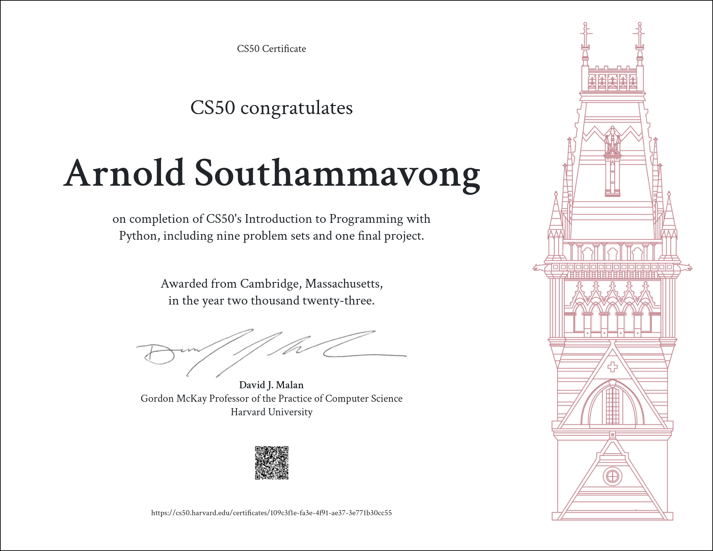

# CS50’s Introduction to Programming with Python

 

My submissions to CS50’s Introduction to Programming with Python 2022 problem sets

 

## Table of Contents

#### [Week 0](/problem_sets/week_00_functions-variables/) - [Functions, Variables](https://cs50.harvard.edu/python/2022/weeks/0/)

-   [Indoor Voice](/problem_sets/week_00_functions-variables/indoor/)
-   [Playback Speed](/problem_sets/week_00_functions-variables/playback/)
-   [Making Faces](/problem_sets/week_00_functions-variables/faces/)
-   [Einstein](/problem_sets/week_00_functions-variables/einstein/)
-   [Tip Calculator](/problem_sets/week_00_functions-variables/tip/)

#### [Week 1](/problem_sets/week_01_conditionals/) - [Conditionals](https://cs50.harvard.edu/python/2022/weeks/1/)

-   [Deep Thought](/problem_sets/week_01_conditionals/deep/)
-   [Home Federal Savings Bank](/problem_sets/week_01_conditionals/bank/)
-   [File Extensions](/problem_sets/week_01_conditionals/extensions/)
-   [Math Interpreter](/problem_sets/week_01_conditionals/interpreter/)
-   [Meal Time](/problem_sets/week_01_conditionals/meal/)

#### [Week 2](/problem_sets/week_02_loops/) - [Loops](https://cs50.harvard.edu/python/2022/weeks/2/)

-   [camelCase](/problem_sets/week_02_loops/camel.py)
-   [Coke Machine](/problem_sets/week_02_loops/coke.py)
-   [Just setting up my twttr](/problem_sets/week_02_loops/twttr.py)
-   [Vanity Plates](/problem_sets/week_02_loops/plates.py)
-   [Nutrition Facts](/problem_sets/week_02_loops/nutrition.py)

#### [Week 3](/problem_sets/week_03_exceptions/) - [Exceptions](https://cs50.harvard.edu/python/2022/weeks/3/)

-   [Fuel Gauge](/problem_sets/week_03_exceptions/fuel.py)
-   [Felipe's Taqueria](/problem_sets/week_03_exceptions/taqueria.py)
-   [Grocery List](/problem_sets/week_03_exceptions/grocery.py)
-   [Outdated](/problem_sets/week_03_exceptions/outdated.py)

#### [Week 4](/problem_sets/week_04_libraries/) - [Libraries](https://cs50.harvard.edu/python/2022/weeks/4/)

-   [Emojize](/problem_sets/week_04_libraries/emojize.py)
-   [Frank, Ian and Glen's Letters](/problem_sets/week_04_libraries/figlet.py/)
-   [Adieu, Adieu](/problem_sets/week_04_libraries/adieu.py/)
-   [Guessing Game](/problem_sets/week_04_libraries/game.py/)
-   [Little Professor](/problem_sets/week_04_libraries/professor.py/)
-   [Bitcoin Price Index](/problem_sets/week_04_libraries/bitcoin.py/)

#### [Week 5](/problem_sets/week_05_unit-tests/) - [Unit Tests](https://cs50.harvard.edu/python/2022/weeks/5/)

-   [Testing my twttr](/problem_sets/week_05_unit-tests/test_twttr/)
-   [Back to the Bank](/problem_sets/week_05_unit-tests/test_bank/)
-   [Re-requesting a Vanity Plate](/problem_sets/week_05_unit-tests/test_plates/)
-   [Refueling](/problem_sets/week_05_unit-tests/test_fuel/)

#### [Week 6](/problem_sets/week_06_file-io/) - [File I/O](https://cs50.harvard.edu/python/2022/weeks/6/)

-   [Lines of Code](/problem_sets/week_06_file-io/lines/)
-   [Pizza Py](/problem_sets/week_06_file-io/pizza/)
-   [Scourgify](/problem_sets/week_06_file-io/scourgify/)
-   [CS50 P-Shirt](/problem_sets/week_06_file-io/shirt/)

#### [Week 7](/problem_sets/week_07_regex/) - [Regular Expressions](https://cs50.harvard.edu/python/2022/weeks/7/)

-   [NUMB3RS](/problem_sets/week_07_regex/numb3rs/)
-   [Watch on YouTube](/problem_sets/week_07_regex/watch/)
-   [Working 9 to 5](/problem_sets/week_07_regex/working/)
-   [Regular, um, Expressions](/problem_sets/week_07_regex/um/)
-   [Response Validation](/problem_sets/week_07_regex/response/)

#### [Week 8](/problem_sets/week_08_oop/) - [Object-Oriented Programming](https://cs50.harvard.edu/python/2022/weeks/8)

-   [Seasons of Love](/problem_sets/week_08_oop/seasons/)
-   [Cookie Jar](/problem_sets/week_08_oop/jar/)
-   [CS50 Shirtificate](/problem_sets/week_08_oop/shirtificate/)

#### [Week 9](/problem_sets/week_09_final_project/) - [Final Project](https://cs50.harvard.edu/python/2022/weeks/9)

-   [Final Project](/problem_sets/week_09_final_project/project/)
